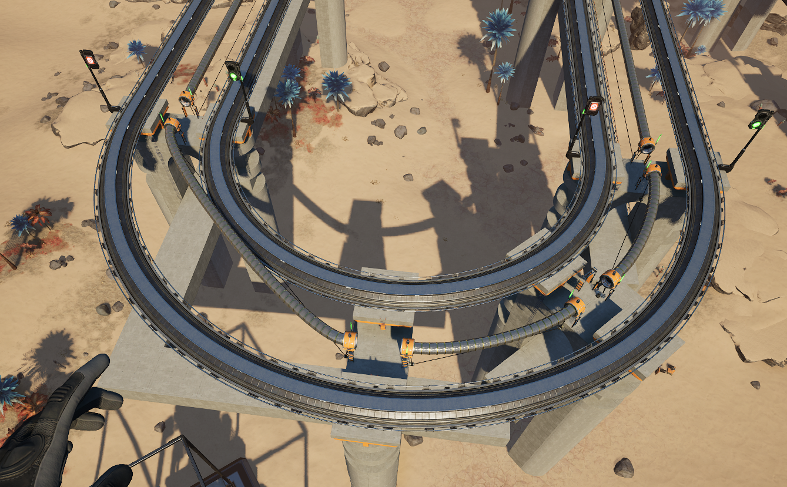

# Satisfactory Server Info
> [!NOTE]
> A unit of **10f** means 10 foundations (usually width)
>
> A unit of **4m** means 4 meters (usually height, and referencing specific foundation blocks)
## General Rules
### Trains
* Rails are one-directonal, and right handed.
    * Signals are on right hand of tracks.
* In general 2 parallel one-way tracks are used.
* Only assign one train to one import line.
    * Import trains can be set to wait until unloaded due to 1/1 relationship.
* 1-(4) Setup
    * 1 engine followed by up to 4 cars.

> [!NOTE]
> Reasoning:
> * The max power line distance is **12.5f** long.
> * A 5 car setup takes up 2f each car for 10f total, so 1 blocking signal at each pylon perfectly fits 1 max sized train.
> * 1 locomotive can carry 4 full cars reliably uphill at 2m incline.

> [!CAUTION]
> **DO NOT MIX STATION RESOURCES IN A SINGLE LINE**
>
> * i.e. If you want to import X and Y resource, **DO NOT** import in a single line 4 stations with 4 mixed cars XXYY. Instead have 2 lines, one with XX the other with YY, or XXXX, YYYY.

## Blueprints

### Train Pylons
* Pylons are double sided, they can face either way, it doesn't matter.
    * Sloped pylons do have a direction (up or down)
* Pylons are separated by **10f** when level.
* **10f** separation for inclines too (zoop out **2m** slope using the **Double Ramp (4m)** foundation for the inclines).
        * Inclines **DO NOT USE** blocks due to rollback risk and subsequent derailment during power outage/traffic buildup.
        * The block signal directly before an incline **MUST** also be removed, due to the same rollback risk.

> Pylons are separated by 10f in between, and they sit on a single foundation tile.

> Place directly on top of the foundation. You can use the ctrl key for precise placement, although it is usually easiest to hit H for hold, and then nudge with the arrow keys into place. If you screw up you can remove the whole blueprint at once in the blueprint deletion mode (hit R).

> Place the lower pylons until it clips into the ground. Easiest in blueprint mode, however you still may need to nudge with H and arrow keys into place.

> When connecting rails, if you connect to the center by accident or you will have overlapping rails.

> This is correct. If dealing with slopes or intersections it might be easier to remove the blueprinted rail and do it manually, it's just there for easier snapping, and for the built-in signals.

> [!IMPORTANT]
> Remember to connect the hypertubes and daisy-chain the power connectors as well.

### Pylon Sloped

> Use the (4m) version for a 2m slope.

> Important things to note here:
> * **MIDDLE TO MIDDLE**. The extra rail pieces from the flat pylon were deleted and rail was pulled from the middle. Where you start and end the slope affects the way things bend and it will look ugly otherwise if not matched up.
> * The 10f zooped worth of slope in between.
> * The pylon itself is laying on a flat foundation, not a slope.
> * The signals were removed from the bottom, to prevent sliding collisions.
> * You can use the ctrl key to more easily snap to the center line.
> * It's okay if the rail is yellow/overlapping here.

> [!CAUTION]
> Do not use slopes for the very end or you will get this mess. Only use slopes on the way up, with the top pylon being a normal pylon.

> Using the slopes and normal pylons correctly. Hypertube connections are best set to Noodle for these connections otherwise they look weirdly straight.

### Pylon 45-degree turn

> Move outward 1f, then place another, but rotate 1 notch 45 degrees and zoop out 2. Remember to remove the extra rails to snap directly to center.

### Pylon 90-degree turn

> 5x5f turn. Remember to remove the extra rails to snap directly to center.

> Two, 45-degree pylon turns on the right, vs. one 90-degree pylon turn on the left. Notice how the hypertube gets really stretched for the 90-degree turn.
